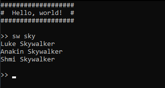

# ItsMyConsole

Framework pour application Console .Net pour la construction d'interpréteur de ligne de commande interne.

## Sommaire
- [Pourquoi faire ?](#pourquoi-faire-)
- [Getting Started](#getting-started)
- [Configurer les options](#configurer-les-options)
- [Ajouter des interprétations de commande](#ajouter-des-interprétations-de-commande)
- [Commande "exit"](#commande-exit)
- [Ajouter d'autres Outils](#ajouter-dautres-outils)
- [Comment créer ses propres Outils ?](#comment-créer-ses-propres-outils-)

## Pourquoi faire ?
Vous allez pouvoir créer une application Console .Net qui attend la saisie d'une ligne de commande pour lancer vos propres actions spécifiques. 

Le Framework ```ItsMyConsole``` met en place pour vous :

- L'attente de la saisie d'une ligne de commande avec un prompt personnalisé
- La mise en attente d'une nouvelle commande après chaque exécution
- L'ajout d'une implémentation de l'action à effectuer selon un pattern *(expression régulière)* pour la commande saisie
- La commande *"exit"* qui ferme automatiquement l'application
- La configuration du comportement générale de la Console
    - Texte de l'entête
    - Texte du prompt avant chaque attente de commande
    - Trim *(ou non)* de la ligne de commande (suppression automatique des espaces en début ou fin de la saisie)
    - Saut de ligne *(ou non)* entre chaque attente d'une nouvelle saisie de commande

## Getting Started
1. Créer un projet **"Application Console .Net"** avec le nom *"MyExampleConsole"*
2. Ajouter ```ItsMyConsole``` au projet depuis le gestionnaire de package NuGet
3. Pour cet exemple, ajouter en plus ```Newtonsoft.Json``` au projet depuis le gestionnaire de package NuGet
4. Modifier la méthode **"Main"** dans le fichier **"Program.cs"** par le code suivant :
```cs
using ItsMyConsole;
using Newtonsoft.Json;
using System;
using System.Net.Http;
using System.Text.RegularExpressions;
using System.Threading.Tasks;

namespace MyExampleConsole
{
    class Program
    {
        // HttpClient is intended to be instantiated once per application, rather than per-use.
        static readonly HttpClient _httpClient = new HttpClient();

        static async Task Main(string[] args)
        {
            ConsoleCommandLineInterpreter ccli = new ConsoleCommandLineInterpreter();

            // Console configuration 
            ccli.Configure(options =>
            {
                options.Prompt = ">> ";
                options.LineBreakBetweenCommands = true;
                options.HeaderText = "###################\n#  Hello, world!  #\n###################\n";
            });

            // Star Wars API (SWAPI) find person command implementation [Only results from page 1] 
            // Example : sw sky
            ccli.AddCommand("^sw (.+)$", RegexOptions.IgnoreCase, async tools =>
            {
                string search = tools.CommandMatch.Groups[1].Value;
                HttpResponseMessage response = await _httpClient.GetAsync($"https://swapi.dev/api/people?search={search}");
                response.EnsureSuccessStatusCode();
                string responseBody = await response.Content.ReadAsStringAsync();
                dynamic responseJson = JsonConvert.DeserializeObject(responseBody);
                foreach (dynamic people in responseJson.results)
                    Console.WriteLine(people.name);
            });

            await ccli.RunAsync();
        }
    }
}
```

Voici le résultat attendu lors de l'utilisation de la Console :

 

Dans cet exemple de code on a configuré avec ```Configure```, le prompt d’attente des commandes ```options.Prompt```, la présence d'un saut de ligne entre les saisies ```options.LineBreakBetweenCommands``` et l’en-tête affichée au lancement ```options.HeaderText```. 

Puis avec ```AddCommand```, on a ajouté un pattern d’interprétation des lignes de commande ```^sw (.*)$``` *(commence par **"sw"** puis on capture le reste de la commande)* qui est insensible à la casse ```RegexOptions.IgnoreCase```.

Lors de l'exécution de la Console, si on saisie une commande qui commence par **"sw"** avec du contenu à la suite, il lancera l'implémentation de l'action associée. Dans cet exemple, il récupère le reste de la commande en utilisant ```tools.CommandMatch``` depuis les outils disponibles *(résultat du Match de l'expression régulière)* pour faire une recherche sur les personnages de l'univers Star Wars depuis une API dédiée *(seulement les premiers résultats)*. Avec les informations récupérées, il affiche les noms des personnages dans la Console.

Maintenant que l'on a configuré la Console et l'implémention de l'action associée au pattern ```^sw (.*)$```, l'utilisation de ```RunAsync``` lance la mise en attente d'une saisie de commande par l'utilisateur.

## Configurer les options

Vous pouvez configurer les options de la Console en utilisant ```Configure```.

| Nom de l'option | Description | Valeur par défaut |
| :-------------- | :---------- | :---------------: |
| Prompt | Texte du prompt qui est affiché à gauche de la ligne de commande en attente de saisie | ">" |
| LineBreakBetweenCommands | Indicateur de présence de saut de ligne entre les lignes de commande | false |
| HeaderText | Texte de l'entête de la console qui s'affiche en premier avant l'attente de la première commande | "" |
| TrimCommand | Indicateur pour effectuer un trim en début et en fin de la ligne de commande avant son exécution | true |

```cs
ConsoleCommandLineInterpreter ccli = new ConsoleCommandLineInterpreter();

// Console configuration 
ccli.Configure(options =>
{
    options.Prompt = ">> ";
    options.LineBreakBetweenCommands = true;
    options.HeaderText = "###################\n#  Hello, world!  #\n###################\n";
});
```

## Ajouter des interprétations de commande

Vous pouvez ajouter des interprétations de commande en utilisant ```AddCommand```.

| Nom de l'argument | Description |
| :---------------- | :---------- |
| pattern | L'expression régulière d'interprétation de la ligne de commande. [Aide Mémoire](https://docs.microsoft.com/fr-fr/dotnet/standard/base-types/regular-expression-language-quick-reference) |
| regexOptions | *(facultatif)*<br/><br/>Combinaison d'opérations de bits des valeurs d'énumération qui fournissent des options pour la correspondance de l'expression régulière. *(exemple ```RegexOptions.IgnoreCase```)* [Lien vers la documentation](https://docs.microsoft.com/fr-fr/dotnet/api/system.text.regularexpressions.regexoptions?view=netstandard-2.0) |
| callback | L'action (ou la fonction async) pour l'exécution de la commande associé au pattern |

```cs
ConsoleCommandLineInterpreter ccli = new ConsoleCommandLineInterpreter();

// Simple action with ignore case pattern
ccli.AddCommand("^sw (.+)$", RegexOptions.IgnoreCase, tools =>
{
    // Insert your code here
});

// Simple function async without regex option
ccli.AddCommand("^delay$", async tools =>
{
    await Task.Delay(1000);  // await example
    // Insert your code here
});
```

Dans l'implémentation de l'action, vous avez accès à des outils *(nommé ```tools``` dans l'exemple ci-dessus)*. Les outils par défaut sont une aide pour l'interprétation de la ligne de commande saisie mais Il est possible d'ajouter d'autres **"outils"** avec NuGet ([exemples](#ajouter-dautres-outils)). Vous avez aussi la possibilité [d'en créer vous même](#comment-créer-ses-propres-outils-).

| Nom de l'outil | Description |
| :------------- | :---------- |
| Command | La ligne de commande saisie par l'utilisateur |
| CommandMatch | Le résultat du Match de l'expression régulière de la ligne de commande |
| CommandArgs | La liste des arguments de la ligne de commande. Le caractère ```" "``` est le séparateur. |

## Commande "exit"
Pour fermer l'application Console, vous avez par défaut l'interprétation de la commande ```exit``` *(insensible à la casse)* inclus dans le Framework.

## Ajouter d'autres Outils
Vous pouvez ajouter d'autres outils pour étendre et simplifier vos implémentations d'actions de vos commandes :

- [Azure Dev Ops](https://github.com/dtarroz/ItsMyConsole.Tools.AzureDevOps) : Création et modification des WorkItems sur Azure Dev Ops 
- *(coming soon)* [Cache Global]() : Cache accessible par toutes les actions des commandes

## Comment créer ses propres Outils ?
*coming soon*
